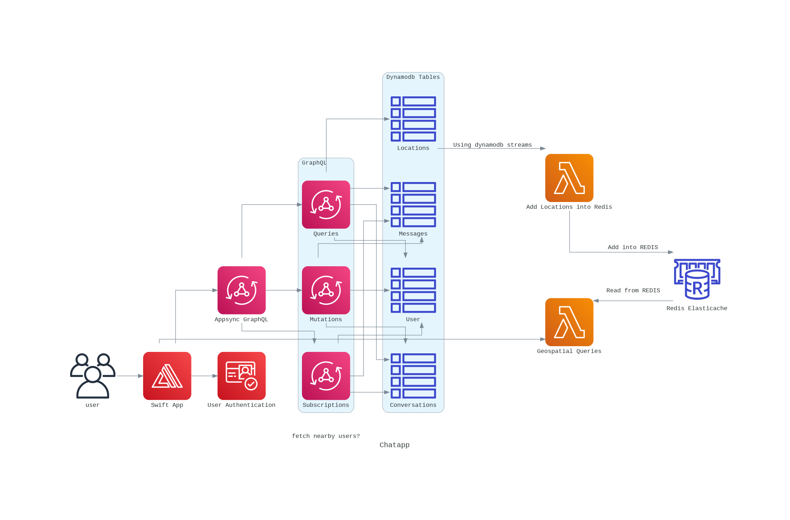
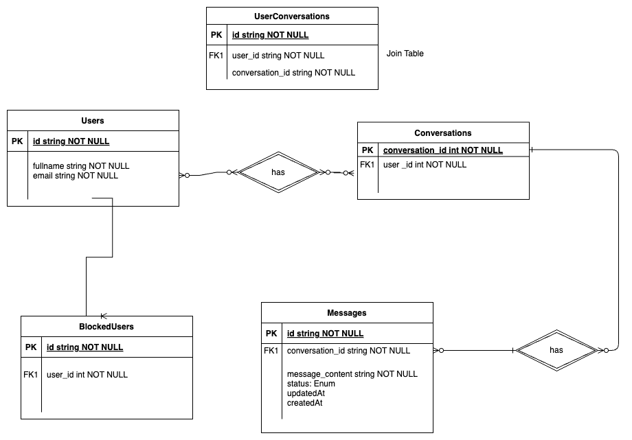

# proximity-based-real-time-chat-app
AWS Appsync, Amplify powered Swift UI real-time mobile chatting app

## Table of Contents

1. [How To Run it Locally](#how-to-run-it-locally)
   
    1.1. [Setup AWS Amplify + Swift App](#get-postgresql-cloud-service-connection-details)
   
    1.2. [Setup Redis Elasticache](#get-redis-cloud-service-connection-details)
   

Diagram created using Diagrams website => https://diagrams.mingrammer.com/

